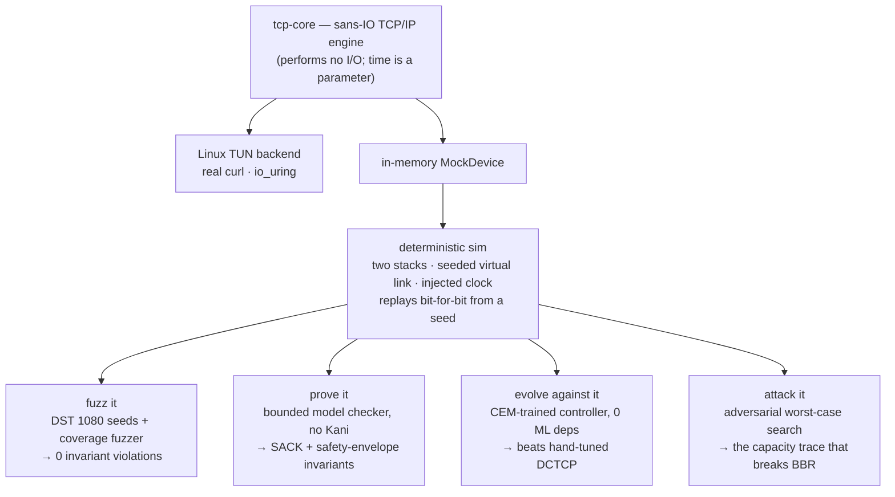

# ferrumnet

[](https://github.com/nomnomBloopBloop/ferrumnet/actions/workflows/ci.yml)
[](Cargo.toml)
[](Cargo.toml)
[](#license)
[](tcp-core/src/lib.rs)

A **userspace TCP/IP stack written from scratch in Rust** — kernel-bypass networking. It sits
between a raw Linux **TUN** device and the application and does, in userspace, everything the
kernel normally does invisibly: parse packets, run the TCP state machine, retransmit lost data,
control congestion, and expose an `async` socket API.

```console
$ curl -v http://10.0.0.2:8080/
*   Trying 10.0.0.2:8080...
* Connected to 10.0.0.2 (10.0.0.2) port 8080 (#0)
> GET / HTTP/1.1
< HTTP/1.1 200 OK
< Server: ferrumnet
< Content-Type: text/html; charset=utf-8
< Content-Length: 442
< Connection: close
```

`curl` believes it is talking to the Linux kernel. It is talking to a few thousand lines of Rust.

## Why it's interesting

Because the core does **no I/O and reads no clock**, the same engine that serves `curl` over a real TUN also
runs deterministically in-process — which turns a *real* TCP into something you can put a **verifier in the
loop** with: fuzz it, prove it, evolve a controller against it, attack it, co-evolve a robust one, certify a
worst-case bound, synthesise the control law modulo a safety proof, repair the unsafe ones, and defend it
against a misbehaving peer — all zero-dependency, all CI-enforced, each claim scoped to exactly what's proven.
(The methodology, in one place: `docs/DESIGN.md` §5.12.)

- **Zero dependencies.** Only the Rust standard library. The TCP/IP logic (no `smoltcp`), the
  async runtime — executor, reactor, `Waker` plumbing (no `tokio`) — and even the syscall
  bindings (including a hand-rolled `io_uring`) are all hand-written. The protocol core is
  `#![deny(unsafe_code)]`; the *only* `unsafe` in the entire project is the syscall FFI in the TUN
  backend — `ioctl`/`poll` in `sys.rs` and the `io_uring` setup/enter/`mmap` in `iou.rs`.
- **sans-IO core.** `tcp-core` performs no I/O and contains no OS-specific code — it ingests
  received bytes and emits bytes to send, with time injected as a parameter. So the whole
  engine, *including the async runtime* (via an in-memory mock device), is deterministically
  unit-testable off-device, including under simulated packet loss, reordering, SACK-based
  selective recovery, **seven pluggable congestion controllers** (Reno / CUBIC / BBR / DCTCP /
  **Prague** / an **evolved** one / a **GP-synthesised** one), and a **two-stack userspace loopback** (two
  instances connecting to each other entirely in memory). **236 tests**, green on Rust 1.92 and the 1.75
  MSRV; Miri-clean (no UB, no leaks, no suppression).
- **It fuzzes itself, deterministically.** Because the core is sans-IO, a `sim` module wires two
  whole stacks through an in-process virtual link with a *seeded* fault model — loss, duplication,
  reordering, bit-corruption — driven by an event scheduler over the injected clock. The same seed
  replays bit-for-bit, so a failing seed *is* the bug report. The headline test runs **1080
  adversarial scenarios** (Reno/CUBIC/BBR × loss × seeds) and every one delivers all bytes intact and
  terminates — and it has teeth (disabling the TCP checksum makes it flag an integrity violation on
  seed 0 at once). This is TigerBeetle/FoundationDB-style **deterministic simulation testing**,
  applied to a real TCP implementation — which production stacks can't do, being entangled with the
  kernel clock and NIC. On top of the fixed grid sits a **coverage-guided greybox fuzzer** whose
  coverage signal is read *entirely off the wire* (the emitted segment-event sequence, AFL-hashed and
  stratified by recovery depth) — **no engine instrumentation** — so the sans-IO core stays untouched
  while a novelty search steers toward behaviour a fixed grid never reaches. (`sim`)
- **It attacks its own controllers.** The same deterministic sim is turned into an **adversary**:
  instead of steering for coverage, `adversary_search` hunts the **capacity trace that maximally hurts a
  controller** — the reproducible bandwidth schedule that drives its standing queue highest or its
  throughput lowest — by a steady-state evolutionary maximiser. The headline, CI-verified finding: a
  **time-varying** trace it discovered **collapses BBR's goodput specifically** (to a sub-2 KB/s crawl)
  while a loss-based controller on the *same trace* barely notices — bandwidth moving underneath BBR's
  windowed-max rate estimate, a BBR-specific weakness found automatically and replayable bit-for-bit.
  (Because the link is controller-agnostic, a controller-specific outcome is the controller's own doing.)
  On the standing-queue objective it instead drives the link to a sustained low-rate throttle that bloats
  BBR's queue **~6× past** its steady-link queue — approaching the loss-based controllers' bloat, the
  low-latency advantage of pacing largely erased. Verifier-in-the-loop, pointed at congestion control. (`sim`)
- **It synthesizes a controller robust to its own worst case.** The synthesize ↔ attack pieces close into
  one **CEGIS loop** (`coevolve`): the CEM evolves a controller, the adversary finds the trace that breaks
  it, that trace joins an archive, and the CEM re-synthesizes against the worst case — minimax, GAN-like, on
  real stack code; every genome is kept inside the bounded-proven safe envelope, and the survivor is then
  `bmc`-certified separately (0 violations). On a **held-out fresh attack** the co-evolved controller
  resists better than its own warm start *and* than the average-optimal one, and the adversary's best
  attack shrinks across rounds — so it is **safe by construction and empirically robust**, at the honest
  cost of average-case throughput (the robustness/performance trade-off). (Observed across seeds in the
  ignored `coevolution_reproduction` — ~1.5–2.4× harder to break, converging in 2–3 rounds; the fast CI
  test enforces a weaker bound and the warm-start/convergence/safety checks.) No ML libraries, no solver,
  zero dependencies. (`sim` + `bmc`)
- **It certifies a worst-case latency — the adversary as a *prover*.** `certify_worst` exhausts a
  discretized capacity-trace envelope and takes the worst — a sound performance bound **over that envelope**,
  the model-checking discipline applied to *performance*, not just safety. It discriminates controllers:
  **Prague's certified worst-case standing queue is 4.1 ms vs Reno's 62 ms**, and the co-evolved
  controller's is 26% of the average-optimal one's. For AIMD/ECN controllers the worst case is — *observed
  exhaustively, not proven* — the minimum-rate trace, and the bound **converges** across nested period
  granularities; for **BBR** — whose rate estimator has no such structural worst case — exhaustion finds a
  **resonant timing pattern** (a spike that primes the estimate before a crash) that beats both the floor
  *and* the sampling adversary, exactly where a performance proof is needed. It is *bounded* over the
  periodic envelope (not the continuum); lifting it to a continuum guarantee — a monotonicity/Lipschitz
  argument — is the open ceiling. (`sim`)
- **It synthesizes the control *law*, not just its gains — modulo a safety proof.** Every controller
  above (even the evolved `Learned`) operates on a hand-written AIMD skeleton. `Synth` removes it: its
  three responses (increase / loss / ECN) are each a tiny **program** — an SSA register machine over the
  live signals (`cwnd`, `flight`, `acked`, `α`, RTT) — and a genetic search discovers the program. The
  novelty is the filter: **every candidate is run through the bounded safety checker (`bmc`) before it is
  ever scored, and one that can break the safety envelope is rejected outright** — "synthesis modulo
  verification", so every survivor is machine-checked safe (unlike a learned/RL controller). The honest
  de-risk verdict: the discovered law is verified-safe and, under the **latency-throughput hinge fitness it
  was bred for** (goodput penalised for standing queue past a 1 ms L4S budget), ranks above *every
  hand-tuned* controller on the held-out set — but that is **not** a Pareto win: on raw goodput it *loses*
  to Reno/CUBIC/BBR (which bury themselves in ~90 ms of queue) and only out-goodputs DCTCP/Prague, buying
  that with a far lower queue; and it loses outright to the gene-tuned `Learned`. Its ECN response
  **rediscovers DCTCP's exact `α/2`** (a unit test pins the value) — a fixed point the search keeps
  returning to. The gap to `Learned` is a characterised constant-resolution limit (the discrete grammar
  `{0.5, 1, 2}` cannot build `Learned`'s finer `≈ α·0.185` gain), which precisely motivates a GP-structure
  + CEM-constant hybrid. (`sim` + `bmc`)
- **The verifier doesn't just reject — it *repairs* (CEGIS-with-repair).** The next turn of the same loop:
  instead of discarding an unsafe candidate, feed the `bmc`'s **counterexample** back as a repair signal —
  it names the violated clause, so a **sound, targeted** repair fixes just the offending response (the
  loss/increase repairs clamp that response's output; the ECN repair resets it to the safe baseline) and
  the result is re-verified. So a near-safe law is *healed*, not thrown away. The load-bearing measure
  (single de-risk seed): repair **discards nothing** — it healed 46 candidates where the filter rejected 55
  — and its survivor is `bmc`-safe and no worse than the seed. That's the win: **sample efficiency at equal
  safety**, not a better law (on that seed its bred fitness was a hair *lower* and its held-out goodput a
  hair higher — within noise; the constant-resolution ceiling from the GP synthesis still binds). (`sim` + `bmc`)
- **It points the adversary at the *protocol peer*, not just the network.** A misbehaving *receiver* can
  try to subvert a sender's congestion control. Classic **ACK division** (Savage et al.) floods the sender
  with many tiny sub-MSS ACKs so a *per-ACK*-growing sender over-inflates its window — and the `bmc` *proves
  the byte bound*: exhaust **every** way of splitting a window of new data across ACKs and the window never
  grows past the **bytes** acked (a per-ACK `cwnd += MSS` strawman is caught violating it, unboundedly). So
  byte counting stops *amplification* — the receiver can't inflate the window past the data it delivered.
  Stated honestly, that's a ceiling, not split-invariance: in slow start the per-ACK `min(MSS)` cap lets a
  receiver splitting a multi-segment stretch ACK still recover full per-segment growth (a real but
  byte-bounded gain; true per-RTT ABC / RFC 3465 would close it), while congestion avoidance's byte
  accumulator is genuinely split-invariant — both pinned in tests. An ACK *above* `SND.NXT` is dropped by
  the RFC 793 acceptability check; the other residual, an **optimistic ACK** of in-flight data, is accepted
  because it's indistinguishable from a genuine one — defeating it needs a receipt nonce, characterised not
  built. (`bmc` + `tcb`)
- **It connects both ways.** Not just a server: it does **active open** (`connect`) as well as
  passive open — the full RFC 793 §3.9 client path, including simultaneous open — so two instances
  can talk to each other with no kernel TCP involved.
- **It's real.** It runs on a Linux box over an actual `/dev/net/tun` device, answers `ping`,
  and serves HTTP to a stock `curl` — handshake, retransmission, congestion control, SACK loss
  recovery, RFC 7323 timestamps, window scaling, delayed ACKs, orderly teardown and TIME-WAIT,
  all on the wire. An optional `io_uring` backend batches the packet I/O.

## Benchmarks

Measured on a 2-vCPU ("Common KVM processor") Ubuntu 22.04.5 VPS (kernel 5.15, Rust 1.75) over
`tun0`, a same-host path — so it measures the stack's processing efficiency, not link speed.
Figures are **medians** over the runs noted; the VPS is shared, so the occasional outlier is a
contention dip (median is robust).

- **Throughput** (`GET /bench`, 64 MiB, single-threaded): **~140 MB/s** at the default 1500-byte
  MTU (median of 10), and **~337 MB/s** at MTU 65535 (median of 10; 9 of 10 runs in 316–356). The
  advertised MSS auto-adapts to the device MTU, so a larger MTU sends the same data in ~2.4× fewer
  packets — and `write` syscalls. (SACK does not change no-loss throughput; it is inactive at 0%
  loss.)
- **io_uring backend** (`FERRUM_IO=uring`, opt-in, falls back to blocking I/O): batches every read
  and write into **one `io_uring_enter` per event-loop turn**, lifting MTU-1500 throughput
  **~1.24× (148.6 → 184.3 MB/s, medians of 9, same session)** by removing the per-packet syscall
  overhead — exactly the syscall-bound regime the CPU profile below identifies. `IORING_OP_READ`/
  `WRITE` are generic file ops, so (unlike `sendmmsg`, which returns `ENOTSOCK`) they work on a TUN
  fd. It trades single-packet latency for batch throughput (ICMP RTT 0.10 → 0.32 ms), which bulk
  transfer hides; the sans-IO core is untouched.
- **Two userspace instances, over the wire** (one `connect`s and downloads from the other; the
  kernel forwards between their two TUNs — *both* peers are this stack, so neither end is a
  `curl`-sized window): **125 MB/s** at MTU 1500, **300 MB/s** at MTU 65535 (still ~2.4× — match-MTU
  holds between two fast peers). And the window-scaling result the same-host `curl` bench can't
  show: with **+20 ms RTT** (`netem`) so the window, not CPU, is the limiter, it sustains **11.2
  MB/s** — **3.5× the 3.2 MB/s a 64 KiB window allows at 20 ms** (≈224 KiB in flight), which only
  window scaling (RFC 7323) enables.
- **Latency:** ICMP RTT (100 packets), blocking backend, min/avg/max/mdev =
  **0.047 / 0.099 / 0.180 / 0.028 ms**.
- **CPU** under sustained load (`vmstat`, system-wide over 2 vCPU): MTU 1500 → 30% user /
  **50% system** / 20% idle; MTU 65535 → 28% user / **17% system** / 55% idle. **System time
  collapses with the larger MTU** — the stack is *syscall-bound* at small MTU (a TUN is one packet
  per `write`; it is not a socket, so `sendmmsg` does not apply, and `writev` only *gathers* into a
  single packet). At large MTU the remaining 55% idle is *not* our window: window scaling (RFC 7323)
  is implemented and lifts our 64 KiB cap, but on this same-host bench the limit is the **receiver's**
  window (a localhost `curl` advertises ~64 KiB and refills one ~65 KB segment at a time) and the
  **serial** per-segment processing across the two cores. So scaling doesn't move this number — it's
  what keeps the pipe full on a real high-latency path, which the **two-instance benchmark above
  measures directly** (11.2 MB/s at +20 ms RTT, 3.5× the 64 KiB cap). The remaining lever is
  pipelined I/O — the **io_uring backend above** does exactly that at MTU 1500, where the profile is
  syscall-bound.

**Under packet loss** (live `tc netem` dropping our *outbound* data, 4 MiB), measured **before and
after SACK in the same session** — every transfer completes correctly, and **SACK selective
repair** (RFC 2018 + RFC 6675) recovers the tail far faster than go-back-N:

| packet loss | 0% | 1% | 2% | 5% | 10% |
|---|---|---|---|---|---|
| go-back-N (before) | 93.9 | 9.2 | 2.5 | 0.40 | 0.10 |
| **SACK (now)** | **94.6** | **91.4** | **9.3** | **2.0** | **0.4** |
| speedup | 1.0× | ~9.9× | ~3.7× | ~5.0× | ~4.0× |

(MB/s, medians; ~4–10× faster across the tail. Loss is stochastic — the 2% cell is bimodal,
splitting between ~6–14 and ~70–78 MB/s depending on where losses fall.)

**Congestion control — Reno vs CUBIC vs BBR.** The controller is **pluggable**: a
`CongestionControl` trait behind a match-dispatched `Cc` enum (no `Box<dyn>`, zero-alloc, sans-IO),
selectable at runtime with `FERRUM_CC={reno,cubic,bbr,dctcp,prague,learned}`. Five are hand-written from
the RFCs (DCTCP and Prague in the latency-leap section below, the evolved `learned` one after it) — the
first three being
**Reno** (RFC 5681), **CUBIC** (RFC 8312, the Linux default: cubic window growth + the TCP-friendly
region), and **BBR** v1 (model-based — it estimates bottleneck bandwidth and min-RTT and *paces* to
the bandwidth-delay product instead of reacting to loss, with a full STARTUP→DRAIN→PROBE_BW→PROBE_RTT
state machine and a Cheng/Cardwell delivery-rate estimator). The sans-IO core makes every phase
deterministically unit-testable off-device. Measured over the two-instance bench (one stack
downloads 8 MiB from another across two kernel-forwarded TUNs) at a `netem`-imposed **20 ms RTT** so
the *window*, not the CPU, is the bottleneck (MB/s, medians of 3):

| 20 ms RTT | 0% loss | 0.5% | 1% | 2% |
|---|---|---|---|---|
| Reno    | 7.6 | 1.0 | 0.8 | 0.5 |
| CUBIC   | 7.4 | 1.5 | 0.9 | 0.6 |
| **BBR** | **10.5** | 0.6 | 0.7 | 0.5 |

At **0% loss** BBR leads by ~40%: pacing to the BDP fills a short high-RTT flow faster than
Reno/CUBIC's slow-start ramp. **Under loss** the story has two halves, both worth telling.

*BBR's window — the BBRv2 `inflight_hi`/`inflight_lo` bounds.* BBR v1 is loss-agnostic, so it kept
filling until its whole send buffer was in flight — which piles up more simultaneous holes than the
3–4-block SACK option can report, so the unreported holes wedge `snd_una` and recovery falls to
one-segment-per-RTO go-back-N (≈180 RTOs → a de-facto timeout; traced directly). The BBRv2-style fix
caps in-flight data with an AIMD pair (`inflight_lo`/`inflight_hi` — halved on loss, probed back up
between losses, hard-cut on RTO) plus ACK-aggregation, so under loss BBR runs a persistent, reno-like
window instead of over-filling. That made BBR **robust** (no more collapse) — but on its own it did
**not** move the median: it was still ~0.2 MB/s.

*The real lever — the shared recovery path.* Window control couldn't help because the wedge is
*sticky*: once `NextSeg` returns `None` the old recovery advanced `snd_una` one segment per **RTO**,
so a single bad burst pinned the whole transfer at ~0.2. The fix re-arms the go-back-N resend on every
cumulative-ACK advance, so a Swiss-cheese window drains one hole per **RTT** instead of per RTO
(O(holes) round trips, not timeouts). It lives in the shared TCB, so it lifts under-loss recovery for
**all three** controllers — and it is what actually moved BBR from a ~0.2 collapse to the table above.

The result: BBR is now **robust and competitive under random loss** — it matches Reno at 1–2% and
trails at 0.5% — while still **winning 0% loss outright**. The residual gap is BBR v1's documented
random-loss weakness: loss drags down the measured delivery rate, so pacing throttles below the
loss-based controllers. (That trade-off is exactly why later BBR versions react to loss.) Reno/CUBIC's
congestion control is untouched — the BBR loss-response hooks are no-op trait defaults; only the
shared go-back-N drain, a correctness/efficiency fix, changed for them.

**Where BBR is *supposed* to win — a bottleneck queue.** Uniform random loss is BBR v1's worst case,
not its design target. On a finite-buffer bottleneck (`netem` 20 mbit rate + 20 ms delay + a deep
queue) — the realistic congestion case — all three saturate the link, but BBR paces to the bottleneck
and keeps the queue near-empty while Reno/CUBIC fill it (bufferbloat), so the latency under load
diverges sharply at the same goodput:

| 20 mbit bottleneck | throughput | RTT under load |
|---|---|---|
| Reno / CUBIC | ~2.4 MB/s | ~109 ms |
| **BBR** | ~2.3 MB/s | **~31 ms** |

Same goodput, **~3.5× lower latency** — the model-based design doing exactly what it exists to do.
The full traced diagnosis is in `docs/DESIGN.md`. At **sub-millisecond RTT** (no shaping, CPU-bound)
the ranking inverts again: Reno's aggressive window (~111 MB/s) beats BBR's pacing (~80 MB/s), which
carries overhead at a tiny BDP. The honest takeaway is the *bottleneck story* — at high BDP the model
wins, on a real bottleneck queue it wins on latency, under pure random loss the loss-based controllers
stay ahead, and at tiny BDP window aggression wins.

**The latency leap — L4S/DCTCP holds a sub-millisecond queue.** BBR's residual queue on the
bottleneck above is the next rung down, and **DCTCP** (RFC 8257, the L4S controller) takes it: it
reacts to *explicit congestion marks* instead of loss, so it parks a far shallower queue. The whole
loop is hand-built — the sender marks its data **ECT(1)** (RFC 3168), a CE-marking AQM flips it to
**CE** the moment the standing queue crosses a threshold (instead of waiting for the buffer to
overflow), the receiver feeds the marks back through the **AccECN** counter (next paragraph), and DCTCP
cuts its window in proportion to the *fraction* of marked bytes (`cwnd ×= 1 − α/2`, with α an EWMA of
that fraction). That proportional response parks the queue near the threshold instead of sawtoothing
through it. DCTCP is a 4th `Cc` variant behind the same trait; the ECN reaction is a no-op default for
the others, so Reno/CUBIC/BBR stay byte-identical. In the deterministic `sim`, a finite-buffer
bottleneck (2.5 MB/s, 4 ms RTT) gains a CE-marking AQM (`Aqm::CeMark`) at a 1 ms threshold — and an 8 MiB
transfer paints the full ladder with **zero variance**:

| same CE-marking bottleneck (sim) | goodput | mean standing queue |
|---|---|---|
| Reno  | ~2.4 MB/s | ~102 ms |
| BBR   | ~2.2 MB/s | ~6.7 ms |
| **DCTCP** | ~2.3 MB/s | **~0.64 ms** |

And it reproduces **on real hardware** — the two-instance bench through a `codel ce_threshold 1ms ecn`
bottleneck at 50 mbit (so the Linux qdisc does the CE marking), latency measured as RTT-under-load via
`ping`:

| 50 mbit CE-marking bottleneck (hardware) | goodput | RTT under load |
|---|---|---|
| Reno  | 6.0 MB/s | 42 ms |
| BBR   | 6.0 MB/s | 1.0 ms |
| **DCTCP** (AccECN) | 6.0 MB/s | **1.14 ms** |
| **Prague** (AccECN) | 6.0 MB/s | **0.92 ms** |

Same goodput across the board; the scalable controllers hold a **sub-millisecond** queue — below even
BBR's paced queue — a **~46× latency reduction** over loss-based Reno at identical throughput, with
**Prague** the lowest (0.92 ms; its gentler RTT-clamped step on this short-RTT path keeps the queue a
hair shallower than DCTCP). Re-measured this session through the same `codel ce_threshold 1ms ecn` qdisc,
now over the **AccECN** feedback path: the deterministic sim result carries through the real Linux
forwarding path, exact CE counts and all. (DCTCP's 1.14 ms vs the earlier one-bit-echo 0.95 ms is the
same exact-vs-over-counting tradeoff the sim shows — the higher figure is the *honest* operating point.)
Both ends run the same controller: there is no SYN ECN negotiation, a documented simplification since the
two stacks are configured together.

**Exact CE feedback — AccECN (RFC 9768).** The feedback channel is the standard **ACE 3-bit counter**,
not a one-bit echo: the receiver counts the CE-marked data packets it accepts and reflects that count
(`mod 8`) in the three header bits **AE · CWR · ECE** on every ACK — AE being byte-12 bit-0 (RFC 3168's
old NS), which the wire now emits and parses, folded into the TCP checksum. The sender differences the
field across ACKs, so the wrapping delta is the *exact* number of its packets the receiver newly saw
marked (counted only for segments whose data it actually accepts, so a dropped-then-retransmitted CE
isn't double-counted). The win over the one-bit echo is exactness under coalescing: a delayed ACK
spanning a CE and a non-CE segment now conveys **exactly one** mark instead of attributing the whole span
as marked. That sharpens DCTCP's α to the true marking level — the demo queue settles at ~0.64 ms (the
earlier ~0.5 ms was the echo's over-counting biasing it low), at comparable goodput. The 3-bit field is
exact only while fewer than 8 marks fall between two ACKs the sender reads; the reactor emits one ACK per
turn and the in-process bottleneck serialises arrivals to ~one segment per turn, so it never wraps here —
a real-device burst of ≥8 CE frames under sustained heavy marking is the inherent limit the byte-accurate
**AccECN Option** (RFC 9768 §3.2.3, a roadmap item) closes. Three documented simplifications: no SYN ECN
negotiation, no change-triggered immediate ACKs, and no AccECN Option (the packet-granular counter is
enough for these controllers on the serialised paths here).

**An evolved congestion controller — beats DCTCP on the frontier, with zero ML libraries.** Because the
sim is a microsecond-fast, perfectly-reproducible environment, it doubles as a *training ground*. A
fifth controller, **`Learned`**, is an AIMD skeleton (slow start, loss multiplicative decrease, additive
increase, a once-per-round ECN cut) whose **gains are a 5-number genome** — the family contains Reno and
DCTCP as special points, so every genome is a *stable* controller. The genome is evolved by a
**cross-entropy method written from scratch in `std`**: keep a per-gene Gaussian, sample a population,
keep the elite, refit — with the Gaussian drawn from a **sum-of-twelve-uniforms** central-limit sample
(no Box-Muller `ln`/`cos`) and the one variance square root done by **Newton's method**, so the
optimizer is as zero-dependency and transcendental-free as the controllers it tunes. The fitness rewards
goodput subject to a sub-millisecond queue. On **held-out** bottlenecks it never trained on:

| held-out CE-marking bottlenecks | goodput | mean standing queue |
|---|---|---|
| Reno | 0.94× line | ~90 ms |
| BBR | 0.88× line | ~8.6 ms |
| DCTCP | 0.53× line | ~0.85 ms |
| **Learned (evolved)** | **0.69× line** | **~0.93 ms** |

The evolved genome lands a distinctly better low-latency frontier point than hand-tuned DCTCP — it
recovers **~30% more goodput at a comparable, still sub-millisecond queue** (a gentler ECN response,
`ecn_a ≈ 0.18` vs DCTCP's 0.5, that doesn't needlessly crush the window), while holding a queue ~9×
below BBR and ~100× below Reno — and it **generalizes to paths outside the training set**. It is a
better frontier *point*, not strict domination (DCTCP's queue is a hair lower, its goodput far lower).
The result is reproducible from a fixed seed (`evolve(&train_set(), 30, 28, 0.25, 12345)`), the baked
genome ships as a constant, and the controller is selectable with `FERRUM_CC=learned`.

**Kernel baseline** (Python `http.server` over `lo`, kernel TCP, 16 MiB): median **~800 MB/s**
(556–893). *Not* apples-to-apples — `lo`'s MTU is 65536 and it is fully in-kernel (no per-packet
syscall or user/kernel copy), so it is structurally faster on this path. Matching the MTU closes
much of the gap (~2.4× here) and io_uring cuts the remaining syscall overhead (~1.24× at MTU 1500);
neither beats in-kernel loopback, which has neither a per-packet syscall nor a user/kernel copy.

## Architecture

```
  curl ──speaks ordinary TCP──▶ Linux routing ──▶ tun0 (10.0.0.0/24) ──raw IP──▶ ferrumnet
                                                                                     │
  ┌─────────────────────── ferrumnet — one process, one thread ──────────────────────┐
  │  tcp-tun (Linux backend, the only `unsafe`)                                        │
  │    TunDevice (blocking read/write/poll) │ io_uring backend (FERRUM_IO=uring)       │
  │    HTTP app (one task per connection)                                              │
  │  ── trait Device ────────────────────────────────────────────────────────────────│
  │  tcp-core (sans-IO · zero deps · #![deny(unsafe_code)])                            │
  │    runtime:  executor + reactor + Wakers  →  TcpListener / TcpStream / TcpConnector│
  │    Stack  →  TCB per connection (active + passive open)                            │
  │      wire (parse + RFC 1071 checksum) · seq (RFC 1982) · isn (RFC 6528)            │
  │      rtt · congestion: Reno/CUBIC/BBR/DCTCP/Prague/Learned/Synth · sack+reasm      │
  │      timestamps (RFC 7323) · delayed ACKs (RFC 1122) · buffers · timers            │
  └────────────────────────────────────────────────────────────────────────────────────┘
```

`tcp-core` is driven by three calls in a loop: `on_recv(bytes)` (update state), `poll_transmit`
(drain bytes to send), and `poll_at`/`on_timer` (timers). The reactor wires those to the device
and wakes the async tasks.

Because that core performs **no I/O and reads no clock**, the *same* engine that serves `curl` over a
real TUN also runs against an in-memory device under a seeded virtual link — which turns it into a
deterministic testbed you can fuzz, prove, evolve against, and attack:



> **The thinking lives in [`docs/DESIGN.md`](docs/DESIGN.md).** It's a component-by-component
> walkthrough that, for each piece, lists the specific correctness traps it has to avoid —
> sequence-number wraparound, the checksum carry-fold and pseudo-header, Karn's rule for RTT
> sampling under loss, the `ack_of_fin` teardown subtlety, the async lost-wakeup race. Every one
> was pinned down by an adversarial design review *before* a line was written, then re-checked by
> a multi-agent adversarial review of the finished code before each commit (the initial review
> found and fixed 11 real bugs; later reviews of active open, delayed ACKs, and the congestion /
> recovery work caught several more — including the post-RTO go-back-N drain re-entering SACK
> recovery and double-sending a hole). If you read one file, read that one.

## The five hard problems

1. **TCP state machine** — 11 RFC 793 states, the three-way handshake, **active open (`connect`)**
   as well as passive, simultaneous open and close, and TIME-WAIT (2·MSL). (`state`, `tcb`)
2. **Retransmission & selective repair** — a send ring with go-back-N retransmission (drained at
   **RTT** pace after an RTO, not RTO pace, so a SACK-invisible Swiss-cheese window recovers in
   O(holes) round trips instead of timing out), Jacobson/Karn RTO estimation (RFC 6298), SACK-based
   selective loss recovery with out-of-order reassembly (RFC 2018 + RFC 6675), RFC 7323
   **timestamps** (Karn-free RTT + PAWS), and **delayed ACKs** (RFC 1122). (`tcb`, `rtt`, `sack`,
   `reasm`)
3. **Congestion control** — **six pluggable controllers** behind a `CongestionControl` trait +
   match-dispatched `Cc` enum (no `Box<dyn>`): **Reno** (RFC 5681 + 6928), **CUBIC** (RFC 8312),
   **BBR** (v1 model paced to the BDP, plus BBRv2 `inflight_hi`/`inflight_lo` bounds + ACK-aggregation
   for under-loss throughput), **DCTCP** (RFC 8257, the L4S/ECN controller — ECT marking, exact CE feedback via the AccECN ACE counter (RFC 9768),
   a proportional `cwnd ×= 1 − α/2` cut that holds a sub-millisecond queue), **Prague** (the L4S
   scalable controller, RFC 9330 — DCTCP's ECN response plus an **RTT-independent** additive increase so
   flows of different RTT share fairly, and a classic Reno loss fallback), and an **evolved**
   controller whose gains were trained against the deterministic sim by a from-scratch cross-entropy
   method (zero ML libraries) and beat hand-tuned DCTCP on the held-out frontier. Selectable with
   `FERRUM_CC`. (`congestion`, `bbr`, `sim`)
4. **Zero-copy parsing** — header views over `&[u8]` and the one's-complement Internet checksum
   (RFC 1071), with a clean RX/TX borrow split. (`wire`)
5. **Async integration** — the `Waker` lifecycle over the sans-IO core, built on the safe
   `std::task::Wake` trait. (`runtime`)

## What I learned

The bug that taught me the most wasn't in the TCP state machine — it was the checksum, and it
was invisible. `ping` worked perfectly, which "proved" the device, the IPv4 layer, and my
one's-complement checksum were all fine. But `curl` would complete the handshake and then hang.
`tcpdump` showed my SYN-ACK and data segments leaving the interface looking correct — yet the
client never made progress.

The cause lives at the boundary between my code and the kernel. When a packet is generated on
the same host and handed to a TUN device, Linux leaves the TCP checksum field **zero**: it
assumes a real NIC will fill it in on the way out via hardware TX offload. A software TUN device
has no NIC, so those segments reached my stack with a checksum of `0x0000`, and my verifier was —
correctly, per the RFC — rejecting every single one as corrupt, silently. ICMP slipped through
only because the kernel checksums ICMP itself. The fix was twofold: disable TX checksum offload
on the interface (`ethtool -K tun0 tx off`), and have the stack treat an on-wire checksum of
`0x0000` as "offloaded, accept" rather than "corrupt, drop."

The lesson stuck: *"the protocol is correct"* and *"it works end to end"* are completely
different claims, and the hardest problems in a network stack aren't in the spec — they're in the
half-truths about what the layer beneath you actually does. (Close runner-up: a parked
`read().await` that hung forever when the peer sent a RST, because the reactor only woke a reader
on *new data*, never on *the connection going away*.)

## Layout

| Crate | Role |
|---|---|
| `tcp-core` | Device- & OS-agnostic, `std`-only TCP/IP engine + async runtime. Builds & tests anywhere. |
| `tcp-tun` | Linux backend: `TunDevice`, the reactor, and the HTTP demo. |

## Build & test

The protocol core builds and tests on any platform:

```sh
cargo test -p tcp-core      # 236 tests: unit + in-memory integration + loss/SACK/teardown
                            #            + two-stack loopback + timestamps + delayed ACKs
                            #            + CUBIC + BBR (rate sampler, windowed filter, phases,
                            #            inflight bounds) + DCTCP/L4S (ECT marking, AccECN ACE counter,
                            #            alpha, CeMark AQM, the sub-ms latency ladder) + Prague + the
                            #            dual-queue coexistence + an evolved controller (CEM trainer,
                            #            held-out frontier) + go-back-N drain
                            #            + deterministic simulation testing (1080 adversarial seeds)
                            #            + a coverage-guided greybox fuzzer (off-the-wire coverage)
                            #            + a bounded model checker (exhaustive SACK / option proofs +
                            #            the controller safety envelope over the whole genome family)
                            #            + an adversarial worst-case search (the capacity trace that
                            #            bloats BBR's queue ~6x / collapses its goodput)
                            #            + GP control-law synthesis (bmc as a hard reject filter)
                            #            + CEGIS-with-repair (bmc counterexample heals the law)
                            #            + misbehaving-receiver defence (ACK-division byte-bound proof)
```

The TUN backend + live demo run on **Linux** (needs root for the device + routing):

```sh
cargo build --release -p tcp-tun
sudo ./target/release/tcp-tun tun0 &     # creates tun0, serves HTTP on 10.0.0.2:8080
# (FERRUM_IO=uring ./target/release/tcp-tun tun0  — the io_uring backend instead of blocking I/O)
sudo ./scripts/tun-up.sh                 # address + route + disable checksum offload
curl http://10.0.0.2:8080/               # the win condition
curl -o /dev/null http://10.0.0.2:8080/bench/64   # 64 MiB throughput test
sudo ./scripts/tun-down.sh
```

The setup is scoped to `10.0.0.0/24` on `tun0` and never touches the host's default route or
IP forwarding, so it is safe to run alongside other services.

## Roadmap

The big milestones are done — active open, SACK loss recovery, MTU-adaptive MSS, window scaling,
RFC 7323 timestamps, delayed ACKs, an io_uring backend, **seven pluggable congestion controllers**
(Reno/CUBIC/BBR/DCTCP/Prague plus an evolved and a GP-synthesised one) measured head-to-head over the
two-instance hardware bench, and a **coverage-guided fuzzer** over the deterministic sim. What's left:

- **BBR under random loss — done, with a known residual.** BBRv2 `inflight_hi`/`inflight_lo` bounds
  + ACK-aggregation, plus an ACK-clocked go-back-N drain that un-sticks the post-RTO wedge, took BBR
  from a ~0.2 MB/s collapse to robust-and-competitive (matches Reno at 1–2% loss, table above). The
  residual gap at light loss is BBR v1's documented weakness — loss depresses the measured delivery
  rate, so pacing throttles. Closing it fully needs a **loss-aware delivery-rate estimate** (the
  direction later BBR versions take). Full traced diagnosis in `docs/DESIGN.md`.
- **Deterministic simulation testing — done (the `sim` module), and the foundation for everything
  above.** Two stacks over a seeded, fault-injecting virtual link, replayable from the seed. It grew
  three layers on top: a **bit-reproducible congestion-control testbed** (a virtual *bottleneck* +
  AQM, behind the DCTCP latency ladder), a **coverage-guided greybox fuzzer** (off-the-wire coverage,
  a deterministic correctness oracle that found zero invariant violations across thousands of
  coverage-steered mutations), and the **CEM training ground** for the evolved controller.
- **Fuzz it *and* prove it — done (the `bmc` module).** Alongside the sampling fuzzer, a hand-rolled
  **bounded model checker** (zero-dep, no Kani/CBMC — just exhaustive `std` loops) *exhausts* a small
  but complete slice of the input space: every SACK-scoreboard operation sequence up to depth 3 over a
  small window (~400 K reachable states, at sequence 0 *and* across the 2³² wrap) and every TCP option
  layout up to two words (~1.7 M), confirming the scoreboard's structural invariants, the RFC 6675
  `pipe ≤ inflight` bound, and the option walker's panic-freedom. So the stack is one you can *fuzz,
  train against, and prove*.
- **Provably-safe *synthesised* congestion control — the new bit.** The bounded model checker is also
  turned on the **controllers**, which closes the loop with the evolved `learned` one: learned/RL
  congestion control is undeployable precisely because it's an opaque black box no operator trusts not to
  misbehave. So a controller is driven through *every* event sequence (acks / ECN marks / losses / RTT
  samples, the loss FlightSize modelled independently of `cwnd` — including larger than it, as the real
  stack reaches when `cwnd` is cut mid-flight) and a five-clause **safety envelope** is asserted after
  each: never starve the window (`cwnd ≥ MSS`); a loss never inflates `cwnd` above the FlightSize (it
  *cuts* the in-flight bytes, RFC 5681 — `md_loss < 1`); an ECN mark never grows `cwnd`; a clean ACK never
  shrinks it; `ssthresh ≥ 2·MSS` after loss. Reno/DCTCP/Prague and the baked genome all satisfy it
  exhaustively, and so does the **sanitised genome grid** — all 243 genomes at each gene's min/mid/max
  (~1.3 M controller states). Four of the five clauses hold *structurally* for any genome (the cuts floor
  at MSS/2·MSS, the additive step floors at 1 byte, the ECN cut is `clamp(·, 0, ecn_max)`), and the only
  gene-dependent one binds at the `md_loss` max the grid includes — so the **whole continuous sanitised
  family** is safe by that argument. An *unsanitised* `md_loss = 2` genome is caught inflating `cwnd` past
  the FlightSize on loss, proving the safety clamp is load-bearing. This is **"evolve *and* prove"**: a
  learned controller confined, by machine-checked construction, to a region that can't *violate the safety
  envelope* — the assurance learned controllers usually lack. (An adversarial review caught the first cut
  of this modelling the FlightSize off the live `cwnd`, which hid exactly the `flight > cwnd` loss
  responses; the fix models it independently and the proof now holds over the real contract.)
- **Adversarial worst-case discovery — done; co-evolution is the next step.** The deterministic sim is
  inverted into an **adversary** (`adversary_search`): instead of fuzzing for coverage or evolving a good
  controller, it searches a bounded **capacity-trace** envelope (a 16-slice, 30–150 %-of-base-rate
  schedule, cycled over the transfer) for the trajectory that maximises a controller's cost — mean/max
  standing queue, or throughput shortfall — by a steady-state evolutionary maximiser (an elite corpus
  mutated and tournament-biased toward the worst-so-far), compared against blind random sampling at equal
  budget. The bounded floor keeps the *link* always able to deliver, so a **byte-integrity** failure would
  be a stack bug (the fuzzer's oracle) while a **completion timeout** is the adversary driving a controller
  into a near-livelock; every trace replays bit-for-bit. The headline, CI-verified finding (the genuine
  timing pathology): a **time-varying** trace it discovered **collapses BBR's goodput specifically** to a
  sub-2 KB/s crawl while Reno/CUBIC/DCTCP complete the *same* trace at ~1 MB/s — bandwidth moving underneath
  BBR's windowed-max rate estimate; the asymmetry proves it is BBR's own weakness, since the link is
  controller-agnostic. On the standing-queue objective the search instead drives toward a sustained
  low-rate throttle, bloating BBR's queue from **15.5 ms** on a steady link to **~100 ms (6.4×)** — a worse
  operating point, not a timing trick, and in this low-dimensional schedule space blind random sampling is
  itself a strong baseline (the guidance's surer value is the single refined, reproducible worst case).
  This is CEGIS / verifier-in-the-loop for congestion control.
- **Co-evolution — done; the loop closes.** `coevolve` wires synthesis (CEM) ↔ attack (adversary) ↔ a
  growing counterexample archive ↔ re-synthesis into a minimax loop; the survivor is then certified by the
  `bmc` safety envelope. On a held-out fresh attack the co-evolved controller resists better than its own
  warm start and than the average-optimal one (~1.5–2.4× harder to break across seeds), and is **bounded-
  proven safe** — **safe by construction, empirically robust**, on real stack code, zero ML/solver deps —
  at the honest cost of average-case throughput.
- **Performance proofs, not just safety proofs — done (bounded).** `certify_worst` exhausts a discretized
  capacity-trace envelope to certify a controller's **worst-case standing queue** — a sound performance
  bound, the adversary turned into a *prover*. It discriminates (Prague 4.1 ms vs Reno 62 ms), converges for
  controllers whose worst case is structural, and for BBR finds a resonant timing pattern that beats the
  sampling adversary. It is *bounded* over the periodic envelope; the open ceiling is **lifting it to the
  continuum** (a monotonicity / Lipschitz argument, the way the safety proof lifted 4-of-5 clauses
  structurally) and folding the whole methodology — fuzz / prove / evolve / attack / co-evolve / certify —
  into a **paper**.
- **L4S — ECN, exact feedback, the scalable controller, and the dual-queue all ship; the coupling is the
  last refinement.** **DCTCP** (RFC 8257) + ECN marking (RFC 3168) + **AccECN** (RFC 9768, the 3-bit ACE
  counter for *exact* per-packet CE feedback) + **TCP Prague** (RFC 9330, the scalable + **RTT-independent**
  controller) + a **dual-queue bottleneck** (RFC 9332 dualPI2 structure: a multi-flow shared link, fair
  per-class scheduler, ECN-classified shallow L4S vs deep Classic queue) all ship now. A Prague + Reno pair
  over the dual-queue coexist — both complete, the L4S flow holds a **~0.6 ms** queue while the classic
  flow bloats to **~90 ms** on the same link (latency isolation a single FIFO can't give). The one piece
  left is dualPI2's **coupled PI-controller marking** (`p_L ≈ √p_C`), which adds robust throughput
  *fairness* across RTT and config on top of the isolation the dual-queue already demonstrates.
- **IPv6** — a second wire format (parse/emit, the pseudo-header checksum); currently IPv4-only.
- **RFC 1122/9293 robustness** — PMTUD (RFC 1191), silly-window avoidance, classic ECN negotiation
  (RFC 3168 — DCTCP here skips the SYN handshake), TCP Fast Open, keepalives, Nagle — the details
  that separate "a TCP" from "real TCP".

Deliberately *not* on the roadmap: AF_XDP / DPDK / RDMA (a different kind of project — RDMA replaces
the TCP stack rather than speeding it) and multi-threading (single-threaded by design; an
`Arc<Mutex>` variant is the documented extension). Nothing in the codebase is stubbed — every code
path that exists is complete and tested; BBR's residual random-loss gap is a measured limitation of a
complete implementation, not a stub.

## References

RFC 791 (IPv4), RFC 793 / 1122 / 9293 (TCP + host requirements, incl. delayed ACKs), RFC 1071
(checksum), RFC 1982 (serial numbers), RFC 5681 + 6928 (Reno + initial window), RFC 8312 (CUBIC),
the BBR congestion-control draft + Cheng/Cardwell delivery-rate estimation, RFC 3168 (ECN) + RFC 8257
(DCTCP) + RFC 9330–9332 (L4S), RFC 6298 (RTO), RFC 2018 + 6675 (SACK & selective recovery), RFC 7323
(timestamps & window scaling), RFC 5961 + 6528 (blind-attack hardening); the cross-entropy method
(Rubinstein) for the evolved controller and AFL-style coverage-guided fuzzing for the greybox search;
W. R. Stevens, *TCP/IP Illustrated, Vol. 1*. Built milestone by milestone; see [`docs/DESIGN.md`](docs/DESIGN.md).

## License

Dual-licensed under either of [Apache License 2.0](LICENSE-APACHE) or [MIT license](LICENSE-MIT) at
your option. Unless you explicitly state otherwise, any contribution intentionally submitted for
inclusion in this work, as defined in the Apache-2.0 license, shall be dual-licensed as above, without
any additional terms or conditions.
